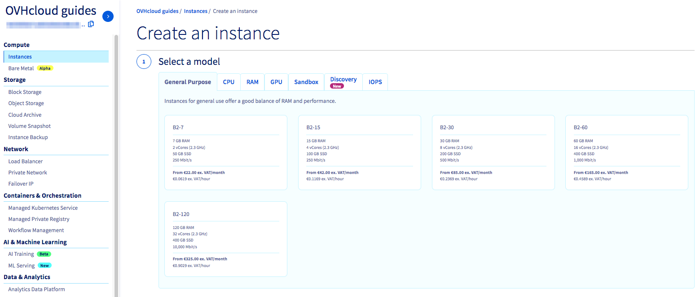

**Ultimo aggiornamento 30/03/2021**

## Obiettivo

Il [Public Cloud OVH](https://www.ovhcloud.com/it/public-cloud/){.external} ti permette di creare server virtuali (istanze), in qualsiasi momento e in tutta semplicità.

**Questa guida ti mostra la procedura da seguire per creare un’istanza dallo Spazio Cliente OVHcloud**

## Prerequisiti

* avere accesso allo [Spazio Cliente](https://www.ovh.com/auth/?action=gotomanager&from=https://www.ovh.it/&ovhSubsidiary=it){.external} OVHcloud
* aver già creato un progetto [Public Cloud](https://www.ovhcloud.com/it/public-cloud/){.external} nel tuo account OVHcloud
* disporre di una chiave SSH nel tuo Spazio Cliente OVHcloud

### Distribuire un’istanza Public Cloud

Per distribuire un’istanza Public Cloud accedi allo [Spazio Cliente OVHcloud](https://www.ovh.com/auth/?action=gotomanager&from=https://www.ovh.it/&ovhSubsidiary=it){.external} Clicca su`Public Cloud`{.action} in alto a sinistra. Poi, nella nuova pagina, clicca sulla freccia accanto al nome del progetto predefinito in alto a sinistra. Seleziona il progetto su cui vuoi creare una nuova istanza.

{.thumbnail}

Dopo aver selezionato il progetto, clicca su`Istanze`{.action} sotto alla sezione “Compute” sul riquadro a sinistra.

{.thumbnail}

Clicca sul pulsante `Crea un’istanza`{.action} Sarai reindirizzato al seguente menu dove è possibile selezionare l’istanza da creare.

{.thumbnail}

La tabella seguente illustra brevemente le differenze tra i diversi tipi di istanze:

| Tipo di Server | Risorse garantite | Note di utilizzo |
| :---         |     :---:      |          :--- |
| General Purpose   | ✓     | Server di sviluppo, applicazioni business o web    |
| CPU     | ✓       | Codifica video o altri calcoli intensivi      |
| RAM   | ✓     | Database, analisi e calcoli in-memory    |
| GPU     | ✓       | Potenza di elaborazione parallela di massa (rendering, Big Data, deep learning, etc.)       |
| Sandbox    | -       | Hosting in risorse condivise per ambienti di test e sviluppo      |
| Discovery    | -       | Hosting in risorse condivise per ambienti di test e sviluppo      |
| IOPS   | ✓     | Ottimizzato per il trasferimento dei dati su disco    |

> [!primary]
>
Inizialmente potrai disporre di un limite massimo di 20 istanze, 20vCores e 40GB di RAM per ogni progetto. Puoi richiedere un aumento delle risorse [aprendo un ticket](https://www.ovh.com/manager/dedicated/index.html#/ticket){.external} al nostro team di Supporto.
>

Segui le indicazioni nel menu per scegliere la localizzazione della tua istanza Public Cloud. Nella terza parte del menu, seleziona il Sistema Operativo.

> [!primary]
>
Se scegli Windows, ti verrà automaticamente fornita una licenza che ti sarà fatturata mensilmente.
>

{.thumbnail}

> [!primary]
>
Le istanze Public Cloud installate su un Sistema Operativo basato su Unix richiedono una chiave SSH per essere aggiunte al server. Per maggiori informazioni su come generare una chiave SSH, consulta la nostra guida [Crea una chiave SSH](https://docs.ovh.com/it/public-cloud/creare-chiave-ssh/){.external}.
>

Nella quarta parte del menu, è possibile scegliere il numero di istanze da creare, il nome e, eventualmente, aggiungere una rete privata o uno script post-installazione. 

{.thumbnail}

Scegli la fatturazione (mensile o oraria).

> [!warning]
>
>Scegliendo la fatturazione mensile per la tua istanza, ti impegni a mantenere questa tariffa almeno fino alla fine del mese in corso. A prescindere dal fatto che l’istanza sia in uso oppure no.
>

Una volta confermate le informazioni inserite, clicca sul pulsante`Crea un’istanza`{.action}per completare l’operazione. L’installazione dell’istanza potrebbe richiedere alcuni minuti.

## Conclusioni

A questo punto dovresti essere in grado di installare un’istanza sul tuo progetto Public Cloud dallo Spazio Cliente OVHcloud. Per maggiori informazioni sull’utilizzo della tua istanza, consulta la [documentazione disponibile nella pagina del supporto](https://docs.ovh.com/it/public-cloud/).

## Per saperne di più 

[Crea il tuo primo progetto Public Cloud](https://docs.ovh.com/it/public-cloud/crea_il_tuo_primo_progetto_public_cloud/){.external}

Contatta la nostra Community di utenti all’indirizzo <https://community.ovh.com/en/>.