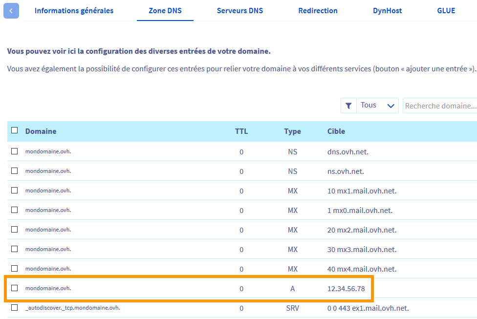

**Dernière mise à jour le 17/02/2021**

## Objectif

Votre site peut afficher une page **Site non installé**, notamment lors de sa mise en place.

**Trouvez l'origine de la page « Site non installé »**

> OVHcloud met à votre disposition des services dont la configuration, la gestion et la responsabilité vous incombent. Il vous revient de ce fait d'en assurer le bon fonctionnement.
> 
> Nous mettons à votre disposition ce guide afin de vous accompagner au mieux sur des tâches courantes. Néanmoins, nous vous recommandons de faire appel à un prestataire spécialisé et/ou de contacter l'éditeur du service si vous éprouvez des difficultés. En effet, nous ne serons pas en mesure de vous fournir une assistance. Plus d'informations dans la section [Aller plus loin](../erreur-site-non-installe/#aller-plus-loin_1) de ce guide.

## Prérequis

- Vous disposez d'une [offre d'hébergement mutualisé](https://www.ovh.com/fr/hebergement-web/)
- Vous êtes connecté à votre [espace client OVHcloud](https://www.ovh.com/auth/?action=gotomanager&from=https://www.ovh.com/fr/&ovhSubsidiary=fr)
- Vous disposez également de la gestion de la [zone DNS](https://docs.ovh.com/fr/domains/editer-ma-zone-dns/) à laquelle est rattachée votre nom de domaine.

## En pratique

La page **Site non installé** s’affiche dans deux situations :

1. L'adresse de votre site n’apparaît pas dans l'onglet [multisite](../multisites-configurer-un-multisite-sur-mon-hebergement-web/#etape-1-acceder-a-la-gestion-multisite) de votre hébergement.

2. Votre nom de domaine est relié, via sa `zone DNS`{.action}, à l’adresse IP d'un autre hébergement OVHcloud. 

Les étapes suivantes vous permettront de corriger l’erreur `Site non installé` dans ces deux situations.

### Étape 1 : Vérifier que votre domaine est bien présent dans l'onglet multisite de votre hébergement

Dans votre espace client OVHcloud, dirigez-vous dans la section `Web cloud`{.action}, puis sur `Hébergements`{.action} dans la colonne de gauche.

Sélectionnez l'hébergement concerné dans la liste, puis cliquez sur l’onglet `Multisite`{.action}. Plusieurs sénarios sont possibles : 

|Scénarios|Action à entreprendre|
|---|---|
|Le nom de votre site apparaît dans le tableau.|Si vous venez d’ajouter le nom de votre site dans le multisite de votre hébergement, patientez une vingtaine de minutes puis rafraichissez le cache de votre navigateur. Si le message « Site non installé » apparaît toujours, passez à [l'étape 2](../#checkdomainlink)|
|Le domaine ou le sous-domaine lié à votre site n'apparaît pas dans le tableau.|Vous n'avez pas encore ajouté votre site dans l'onglet `multisite`{.action} de votre hébergement web. Pour effectuer cette manipulation, consultez notre documentation [Partager son hébergement entre plusieurs sites](../multisites-configurer-un-multisite-sur-mon-hebergement-web/#etape-2-ajouter-un-domaine-ou-un-sous-domaine).|
|Le nom de domaine n’est pas entièrement géré depuis votre compte et a été supprimé sans action de votre part.|Cette situation peut apparaître lorsque le nom de domaine de votre site ou sa zone DNS ne sont pas gérés depuis votre espace client OVHcloud. Pour effectuer l’ajout de votre domaine dans cette situation, consultez notre documentation [Partager son hébergement entre plusieurs sites](../multisites-configurer-un-multisite-sur-mon-hebergement-web/#etape-22-ajouter-un-nom-de-domaine-externe).|

### Étape 2 : Vérifier que votre nom de domaine est relié à votre hébergement par sa zone DNS 

Cette étape vise à vérifier que votre domaine, via sa zone DNS, est bien relié à l’hébergement de votre site.

Pour en savoir plus sur la notion de DNS, consultez ce [document](https://docs.ovh.com/fr/domains/editer-ma-zone-dns/)

#### Étape 2.1 : Déterminer l’adresse IPV4 de votre hébergement OVHcloud

Pour retrouver cette adresse, cliquez sur `Hébergements` dans la colonne de gauche de votre espace client et sélectionnez l'hébergement concerné.

#### Étape 2.2 : Vérifiez l'adresse IPV4 notée dans la zone DNS de votre domaine

Vous devez maintenant vérifier que l'adresse IP de votre hébergement apparaît dans la zone DNS active de votre domaine.

Pour cela, rendez vous dans la partie `Domaines`{.action}, sélectionnez votre domaine puis allez dans l'onglet `Zone DNS`{.action}.

|Scénarios possibles|Action à entreprendre|
|---|---|
|Dans la zone DNS, votre domaine est relié à l'adresse IP de votre hébergement par une entrée de type A |Ceci indique que la configuration de votre nom de domaine est correcte. Suite aux dernières modifications dans vos DNS, votre site s'affichera sous 48 heures au maximum. Pensez également à redémarrer vos appareils (PC, smartphone, box, etc.) et à vider le cache de votre navigateur.|
|Votre zone DNS ne comporte pas d'entrée de type A reliant votre domaine à l'adresse IP de votre hébergement. Ou l'entrée existante pointe sur une autre adresse IP.|Ajoutez un nouvelle entrée de type A ou corrigez l'entrée existante selon ce [document](https://docs.ovh.com/fr/domains/generalites-serveurs-dns/)|
|Votre domaine n'apparaît pas dans la partie `Domaines`{.action} de votre espace client. Ou l'onglet `Zone DNS`{.action} de votre domaine s'affiche de la façon suivante |Cela signifie que votre domaine n'est pas géré depuis votre espace client OVHcloud. Déterminez son registrar via notre outil [WHOIS](https://www.ovh.com/fr/support/outils/check_whois.pl) et les serveurs DNS auxquels il est lié. Retrouvez et modifiez la zone DNS concernée en conséquence selon ce [guide](https://docs.ovh.com/fr/hosting/multisites-configurer-un-multisite-sur-mon-hebergement-web/#etape-22-ajouter-un-nom-de-domaine-externe)|
|Cet avertissement s'affiche dans l'onglet `Zone DNS`{.action} |Vous devrez donc modifier les serveurs DNS de votre domaine en conséquence selon ce [document](https://docs.ovh.com/fr/domains/editer-ma-zone-dns/). 

## Aller plus loin

[Partager son hébergement entre plusieurs sites](../multisites-configurer-un-multisite-sur-mon-hebergement-web/)

[Liste des adresses IP des clusters et hebergements web](../liste-des-adresses-ip-des-clusters-et-hebergements-web/)

[Modifier les serveurs DNS d’un nom de domaine OVHcloud](https://docs.ovh.com/fr/domains/generalites-serveurs-dns/)

[Éditer une zone DNS OVHcloud](https://docs.ovh.com/fr/domains/editer-ma-zone-dns/)

Échangez avec notre communauté d'utilisateurs sur <https://community.ovh.com>.
